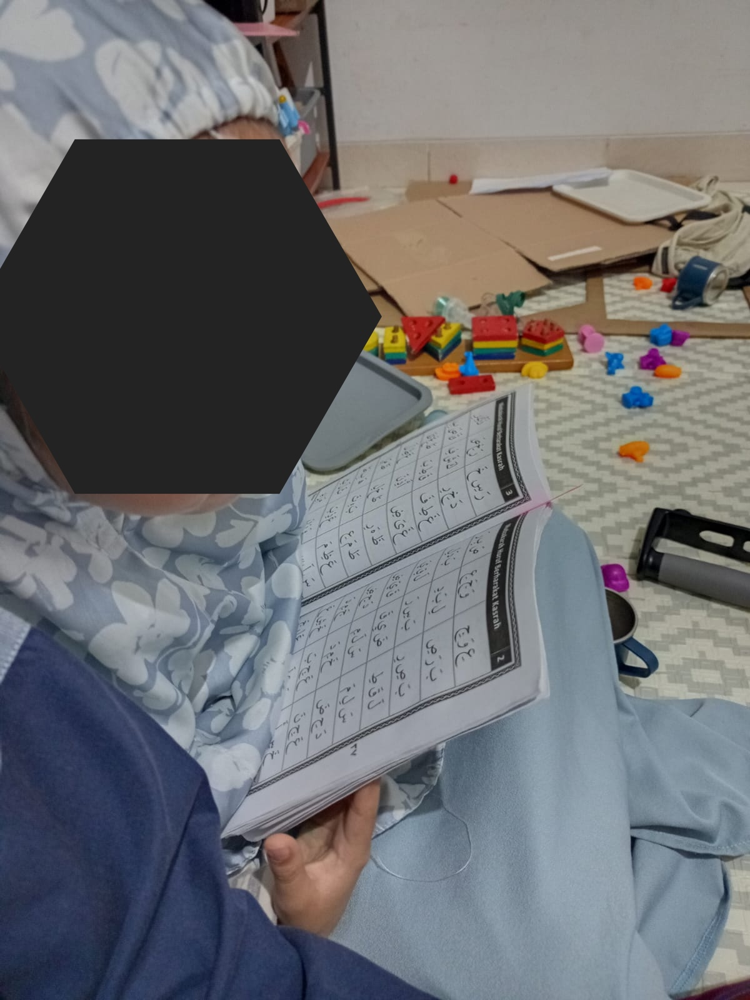

# 04 Agustus 2025 - Log Kegiatan Harian
[Kembali](readme.md)

## 📌 Kegiatan
1. Numerasi:
   - Kegiatan: Melanjutkan mengerjakan worksheet "I am Engineer" Task 13 (Finding the Exact Coordinate)
   - Alat/bahan: Worksheet "I am Engineer", Pensil
   - Durasi: 30 menit

2. Literasi:
   - Kegiatan: Memabca AISAR Jilid 1
   - Alat/bahan: Buku AISAR Lish Shighar Jilid 1
   - Durasi: 30 menit

3. Sains:
   - Kegiatan: Mendengarkan baba menjelaskan proses pembuatan telur asin (saat makan malam)
   - Durasi: 30 menit

## 🎯 Capaian Kegiatan
- Aasiyah dapat dengan mudah memahami pola koordinat pada grid.
- Baca AISM sampai huruf "Pa"
- Belajar proses pembuatan telur asin

## 🚧 Kendala
- 

## 🖼️ Dokumentasi Kegiatan

[Kembali](readme.md)