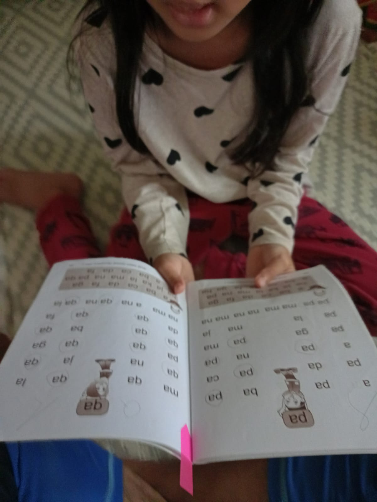

# 07 Agustus 2025 - Log Kegiatan Harian
[Kembali](readme.md)

## 📌 Kegiatan
1. Literasi:
   - Kegiatan: Membaca AISAR Jilid 1 dan AISM
   - Alat/bahan: Buku AISAR Lish Shighar Jilid 1 dan Buku AISM
   - Durasi: 30 menit

2. Numerasi:
   - Kegiatan: Mengerjakan worksheet "I am Engineer" Task 14 (Reading and Understanding the Rule)
   - Alat/bahan: Worksheet "I am Engineer", Pensil
   - Durasi: 30 menit

3. Numerasi:
   - Kegiatan: Mengerjakan worksheet "I am Engineer" Task 15 (Learning Basic Algorithms)
   - Alat/bahan: Worksheet "I am Engineer", Pensil
   - Durasi: 30 menit

4. Cooking:
   - Kegiatan: Membuat Bakwan
   - Alat/bahan: Bahan-bahan untuk membuat bakwan, Wajan, Minyak
   - Durasi: 60 menit

## 🎯 Capaian Kegiatan
- AISAR sampai jilid 1 hal 39
- AISM sampai huruf "qa"
- Task 14 Selesai

## 🚧 Kendala
- 

## 🖼️ Dokumentasi Kegiatan

[Kembali](readme.md)